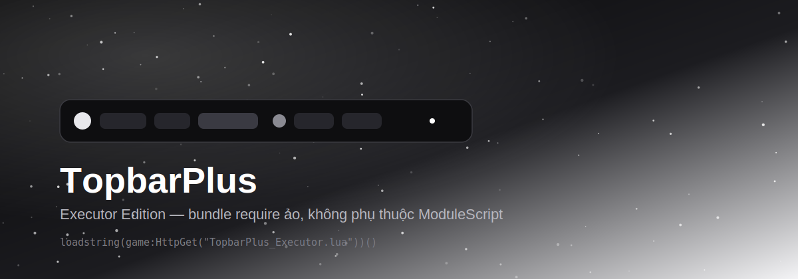
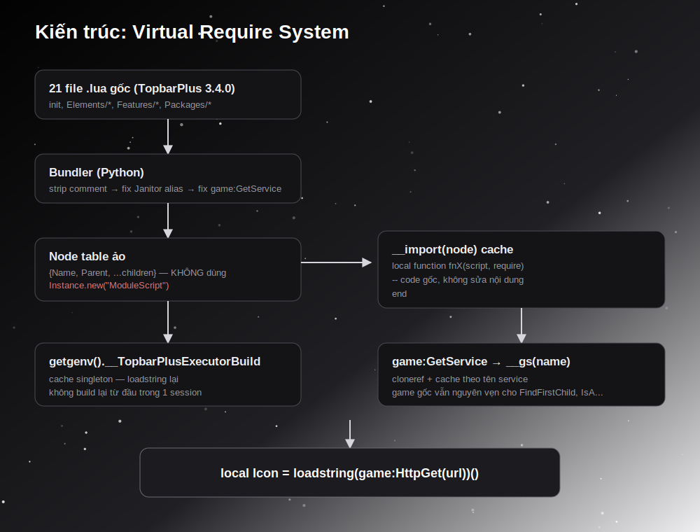
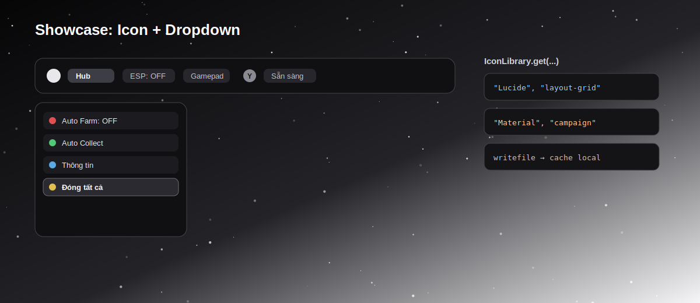

# TopbarPlus — Executor Edition

Bản bundle TopbarPlus 3.4.0 đóng gói lại thành **1 file Lua duy nhất**, chạy trực tiếp bằng `loadstring` trong executor (Delta, Arceus X...), không cần Rojo, không cần `ModuleScript` thật, không comment trong code.



---

## 1. Cài đặt

```lua
local Icon = loadstring(game:HttpGet(
	"https://raw.githubusercontent.com/article-hub-studio/TopbarPlusForExeFully/refs/heads/main/TopbarPlus_Executor.lua"
))()
```

Muốn dùng thêm bộ icon có sẵn (Material/Lucide):

```lua
local IconLibrary = loadstring(game:HttpGet(
	"https://raw.githubusercontent.com/article-hub-studio/TopbarPlusForExeFully/refs/heads/main/IconLibrary.lua"
))()
```

`getgenv().TopbarPlus` được set sẵn sau lần load đầu — gọi `loadstring` lại trong cùng session sẽ trả về instance cũ, không build lại từ đầu.

---

## 2. Vì sao phải bundle lại?

Thư viện gốc dùng Rojo, mỗi file là 1 `ModuleScript` thật nằm trong cây Instance (`src/init.lua`, `src/Elements/*.lua`, `src/Features/*.lua`...). Executor không load được cấu trúc project kiểu này trực tiếp, và việc set `Source` cho `Instance.new("ModuleScript")` tại runtime **không ổn định trên nhiều executor** — đây là lý do bản đầu tiên bị lỗi.

Bản Executor Edition thay bằng **hệ require ảo**: không tạo `ModuleScript` thật, không phụ thuộc `Instance.Source` ghi được hay không.



### Các bước xử lý khi bundle

| Bước | Mục đích |
|---|---|
| Strip comment | Xoá toàn bộ comment, gọn file, không rò rỉ ghi chú nội bộ |
| Fix alias Janitor | Thay `:add(` `:clean(` `:destroy(` → `:Add(` `:Cleanup(` `:Destroy(` — tránh phụ thuộc vòng lặp tạo alias runtime (undefined behavior khi vừa duyệt vừa thêm key) |
| Fix `game:GetService` | Thay bằng `__gs(name)` — cache + `cloneref`, không proxy nguyên `game` (proxy toàn bộ `game` từng gây lỗi `Expected ':' not '.'` khi gọi `FindFirstChild`, `IsA`...) |
| Dựng node ảo | Mỗi file gốc → 1 bảng `{Name, Parent, ...children}`, mô phỏng đúng cây Instance gốc để mọi `require(script.Parent.X)` vẫn chạy đúng |

---

## 3. API Reference (Icon)

Đây là các method hay dùng nhất. Danh sách đầy đủ nằm trong chính file `init.lua` gốc (`function Icon:...`).

### Tạo & hiển thị

| Method | Mô tả |
|---|---|
| `Icon.new()` | Tạo icon mới trên topbar |
| `icon:setName(name)` | Đặt tên nội bộ (debug, tra cứu) |
| `icon:setImage(assetIdOrUrl)` | Đặt ảnh icon |
| `icon:setLabel(text)` | Đặt chữ hiển thị |
| `icon:setCaption(text)` | Chữ gợi ý khi hover/hold |
| `icon:setOrder(n)` | Thứ tự hiển thị trên topbar |
| `icon:setWidth(px)` | Độ rộng tối thiểu |
| `icon:align("left" \| "center" \| "right")` | Căn icon theo cạnh topbar |

### Trạng thái chọn

| Method | Mô tả |
|---|---|
| `icon:select()` / `icon:deselect()` | Chọn / bỏ chọn bằng code |
| `icon.isSelected` | Thuộc tính đọc trạng thái hiện tại |
| `icon:bindEvent("selected", fn)` | Callback khi được chọn |
| `icon:bindEvent("deselected", fn)` | Callback khi bị bỏ chọn |
| `icon:bindToggleKey(keyCode)` | Gán phím tắt (chỉ hiện caption gợi ý, tự bind hành động phải tự viết `UserInputService`) |
| `icon:oneClick(true)` | Icon tự deselect ngay sau khi chọn — dùng cho action 1 lần |
| `icon:autoDeselect(false)` | Không tự bỏ chọn khi bấm nơi khác (dùng cho icon dạng toggle bền) |

### Gộp nhóm

| Method | Mô tả |
|---|---|
| `icon:joinMenu(parentIcon)` | Icon con hiện cạnh icon cha khi cha được chọn |
| `icon:joinDropdown(parentIcon)` | Icon con nằm trong danh sách sổ xuống của cha |
| `icon:setIndicator(keyCode)` | Hiện icon gợi ý phím gamepad |

### Tuỳ biến giao diện

| Method | Mô tả |
|---|---|
| `icon:modifyTheme({Instance, Property, Value, State?})` | Đổi 1 thuộc tính UI con của icon (không có sẵn method riêng cho từng màu/property) |
| `icon:removeModificationWith(Instance, Property, State?)` | Gỡ modification đã áp |
| `icon:getInstance(name)` | Lấy thẳng Instance con (`"IconButton"`, `"IconLabel"`, `"IconImage"`...) để tự gắn thêm UI |
| `icon:setEnabled(bool)` | Bật/tắt, dùng làm hiệu ứng khoá (VIP/Group only) |
| `icon:notify()` | Hiện chấm đỏ thông báo |
| `icon:lock()` / `icon:unlock()` | Khoá icon tạm thời (vd đang loading) |

> **Không có sẵn:** `setImageColor`, `setTheme("TênChuỗi")`. Muốn đổi màu ảnh/nền phải dùng `modifyTheme` với đúng tên Instance con (`"IconImage"`, `"IconButton"`...).

---

## 4. IconLibrary — bộ icon có sẵn

```lua
icon:setImage(IconLibrary.get("Lucide", "settings"))
icon:setImage(IconLibrary.get("Material", "campaign"))
```

- **Lucide**, **Material**: đã có rbxassetid thật từ cộng đồng, dùng ngay.
- **Solar**, **Blade**: chỉ là bộ icon SVG (web icon set) — Roblox **không render được SVG** trong `ImageLabel`, và Luau không có công cụ rasterize SVG→PNG. `IconLibrary.getRawSVG("Solar", "home")` chỉ tải + cache file SVG thô bằng `writefile` để dùng ngoài (tự convert tay), **không dùng làm ảnh icon trực tiếp được**.
- Cache lưu tại `TopbarPlus/IconCache/` qua `writefile`/`readfile` — tải 1 lần, các lần sau đọc từ máy, không cần mạng lại.



---

## 5. Ví dụ nhanh

```lua
local mainMenu = Icon.new()
mainMenu:setLabel("Hub")
mainMenu:setImage(IconLibrary.get("Lucide", "layout-grid"))

local espIcon = Icon.new()
espIcon:setLabel("ESP: OFF")
espIcon:bindEvent("selected", function(icon) icon:setLabel("ESP: ON") end)
espIcon:bindEvent("deselected", function(icon) icon:setLabel("ESP: OFF") end)

local autoFarm = Icon.new()
autoFarm:setLabel("Auto Farm")
autoFarm:joinDropdown(mainMenu)
```

Ví dụ đầy đủ hơn (menu lồng, dropdown, highlight nhấp nháy, cosmetics list kiểu game khác): xem `example_full.lua` và `example_cosmetics.lua` trong repo.

---

## 6. Lỗi hay gặp

| Lỗi | Nguyên nhân | Cách fix |
|---|---|---|
| `missing method 'clean' of table` | Alias Janitor không được tạo đúng lúc runtime | Đã fix trong bản hiện tại — thay thẳng bằng `:Cleanup()` |
| `Expected ':' not '.' calling member function FindFirstChild` | Proxy `game` giả bị dùng sai self khi gọi method khác `GetService` | Đã fix — chỉ `game:GetService` mới qua `__gs()`, còn lại dùng `game` thật |
| Icon không hiện ảnh | `rbxassetid` không tồn tại/sai | Dùng `IconLibrary.get(...)` thay vì tự bịa số |
| Dropdown chỉ còn 1 nút sau khi "đóng tất cả" | Code tự deselect cả icon cha (menu) trong vòng lặp càn quét toàn bộ | Chỉ deselect đúng icon cần đóng, không quét `Icon.getIcons()` bừa |

---

## 7. Tài liệu tham khảo

- TopbarPlus gốc (ForeverHD & HD Admin): https://devforum.roblox.com/t/topbarplus/1017485
- Repo GitHub gốc: `ForeverHD/TopbarPlus`
- Lucide Icons: https://lucide.dev/icons/
- Material Icons (Nebula-Softworks port): https://github.com/Nebula-Softworks/Nebula-Icon-Library
- Lucide → Roblox asset id (port cộng đồng): `frappedevs/lucideblox`
- Solar Icons (Iconify collection, SVG-only): https://icones.js.org/collection/solar
- Blade Icons (SVG-only): https://blade-ui-kit.com/blade-icons

---

*Tài liệu này mô tả bản fork "Executor Edition" — không phải bản chính thức của ForeverHD/HD Admin.*
